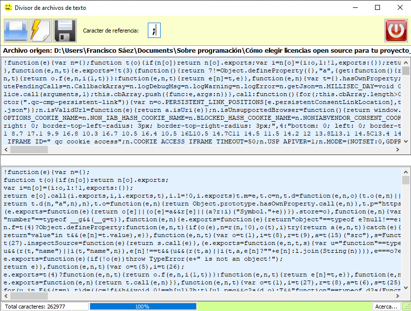
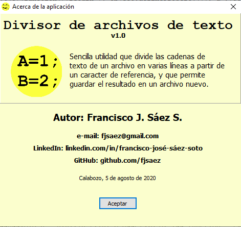

# Divisor de Texto

---

## Descripción

Sencilla utilidad que divide las cadenas de texto de un archivo en varias líneas a partir de un caracter de referencia, y que permite guardar el resultado en un archivo nuevo. La intención de la aplicación es insertar un salto de línea cada vez que en una cadena de texto se consigue un caracter de referencia (en este caso mayormente es el ";"). Estos casos se presentan mucho en código empaquetado JavaScript, y es un trabajo arduo ordenar manualmente el código de archivos sumamente grandes para ser analizado.

El resultado del procesamiento del texto puede ser guardado en un archivo nuevo, quedando así el archivo de origen intacto.

## Modo de uso

* Abrir el archivo de texto a procesar (izquierda). 
* Pulsar en el botón de procesar (centro).
* Pulsar en el botón de guardar (derecha).

El caracter de referencia es el que marca dónde se han de hacer los saltos de línea. La aplicación coloca por defecto el punto y coma (;), pero se puede seleccionar cualquier otro según el criterio del usuario.

## Notas

* Compilado sólo para 32 bits.
* Totalmente funcional.
* Herramienta pensada para actividades de programación.

---

## Lenguaje/framework/base de datos

* Lenguaje: Delphi 10.2 Tokyo. 
* Framework: VCL. 
* Además de los nativos, se emplearon componentes Raize y PNG.

---

## Instalación

No requiere de instalación y es totalmente portable.

---

## Autor

Ing. Francisco José Sáez Soto.

e-mail: **fjsaez@gmail.com**

LinkedIn: **linkedin.com/francisco-josé-sáez-soto**

GitHub: **github.com/fjsaez**

---

Calabozo (Venezuela), agosto de 2020.

---

## Imágenes de la aplicación

### Icono

### Pantalla principal

### Acerca...

